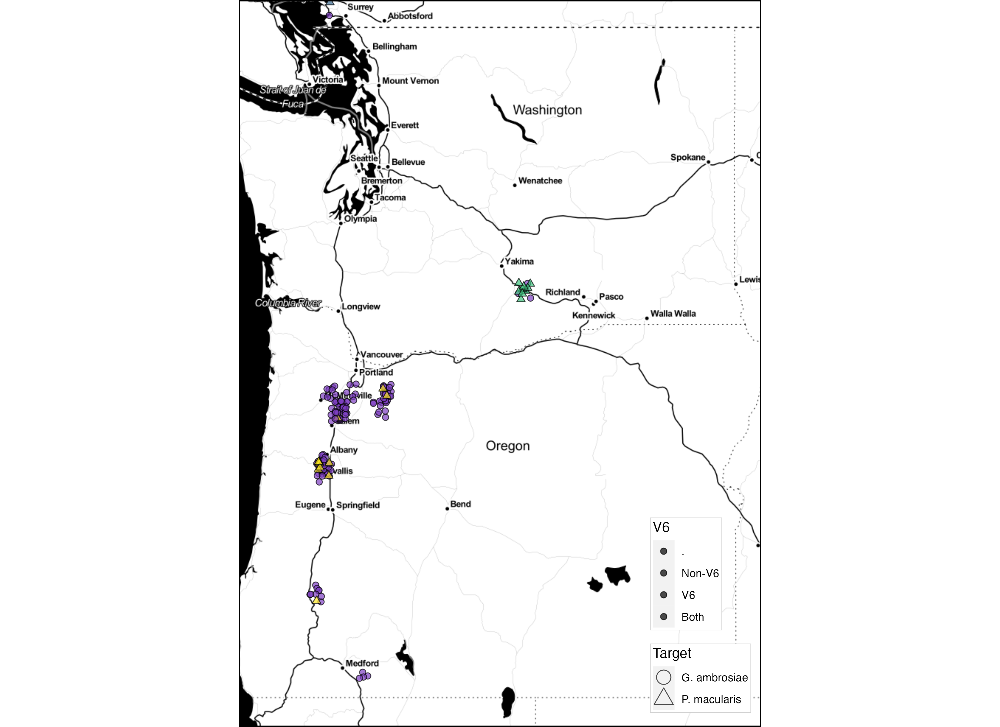

# 2021 Hemp Powdery Milew Survey Code

Learning R can be hard. I'm uploading this code in hopes of helping you learn; I've taken a few classes on stats and data visualization, but I'm largely self-taught, am no expert, and I'm not a very efficient coder; regardless, I hope you will find this helpful. 

## Data availablility

I can't upload a lot of these data due to privacy concerns for growers (also why the points are jittered); however, some of it is publically available and thus you can use very similar code with the available data:

* [2021 USDA-NASS hemp survey results](https://usda.library.cornell.edu/concern/publications/gf06h2430)
* [All kinds of agricultural data](https://quickstats.nass.usda.gov/)

## Resources

Introductory ggmap tutorials: 
* [ggmap by Robin Lovelace](https://rpubs.com/RobinLovelace/ggmap)
* [Custom bounding boxes](https://bigquerygeoviz.appspot.com/)
* [Little miss data ggmap](https://www.littlemissdata.com/blog/maps)
* [ggmap github repository](https://github.com/dkahle/ggmap)
* [iNaturalist mapping by me](https://github.com/mswiseman/R-examples/blob/main/iNat.md)

Introductory ggplot2
* [ggplot2 made easy with esquisse](https://github.com/dreamRs/esquisse)
* [Customizing theme components](https://ggplot2.tidyverse.org/reference/theme.html)

## Load necessary libraries
If you haven't installed any of these libraries, remember you can typically install them through the `install.packages('packagenamehere')` command. For packages not on cran, you can usually install them directly from their github repository using `devtools::install_github("user/repository")`.

```r setup
# to install a bunch of packages at once, uncomment and follow the format below:
#install.packages(c("tidyverse","usmap","scales","ggnewscale","readr","devtools"))

# If you've already installed the packages below, you can load them up with the code below:

library(tidyverse)          # manipulating and plotting data
library(usmap)              # preloaded us maps
library(scales)             # allows scale customization
library(ggnewscale)         # allows for two fill scales
library(readr)              # necessary for loading in csv data
library(lubridate)          # fast changing of dates
library(devtools)           # for loading packages not in CRAN.
library(readxl)             # for reading .xlsx files
library(sp)                 # special tools for spatial data
library(maps)               # loadable maps
library(gridExtra)          # making multi-plot figures
library(basemaps)           # loadable maps
library(sf)                 # special tools for spatial data
library(stars)              # special tools for spatiotemporal data
library(ggmap)              # mapping in a ggplot format
library(raster)             # reading spacial data
library(tidyUSDA)           # auto downloading data from USDA-SASS
library(rgdal)              # bindings to the 'Geospatial' Data Abstraction Library 
library(USAboundaries)      # loadable maps
library(esquisse)           # easy to use ggplot2 sketching program with nice GUI
library(tools)              # for quickly changing headers to titlecase
library(MASS)               # for density calculations
library(viridis)            # colorblind-friendly color palletes 

```

## Load data
*You will have to change your path*

```r
# For disease incidence and taxa layers
Pamb_Pmac_combined_PCR_Positives_Summary_2021 <- read_excel("~2021-Pamb_Pmac_combined_PCR_Positives_Summary.xlsx")
x2022_OR_Raw_Data <- read_excel("~2022_Hemp_Disease_Survey_Field_Info.xlsx", sheet="OR Raw Data")
x2022_WA_Raw_Data <- read_excel("~2022_Hemp_Disease_Survey_Field_Info.xlsx", sheet="WA Raw Data")
x2021_datasheet <- read_excel("~2021_Hemp_PM_Survey_Data.xlsx")

# For sampling sites layer
x2022_Hemp_Disease_Survey_Field_Info_and_Data <- read_excel("~2022_Hemp_Disease_Survey_Field_Info.xlsx")
Hemp_fields_surveyed_2021_22 <- read_excel("~2021-22_Hemp_fields_surveyed.xlsx", sheet= "Sampling_Sites")

# For acreage layer
Hop_acreage <- read_csv("~2017-Slightly-Modified-SASS_Hop_Data.csv")
Hop_acreage_2017 <- read_excel("~2021-22_Hemp_fields_surveyed.xlsx", sheet= "Hemp_Hop_ROUGH_Acreage_Data")
OR_growers <- read_excel("~2022_OR_Growers.xlsx")
WA_growers <- read_excel("~2022_WA_growers.xlsx")
x2021_hemp_national_acreage <- read_excel("~2021-Hemp_National_Acreage_Data.xlsx")


# Slimming columns to save memory
x2021_datasheet_abb <- x2021_datasheet[,c(1:3,6:7,9:13)]


```
## Looking at hemp production by state
Download the [2021 hemp survey results](https://usda.library.cornell.edu/concern/publications/gf06h2430) and remove the spaces and special symbols ($ / , etc.) in the headers to make it more R friendly. You can do this in R, but I find ctrl+f and then replace to be super fast in excel. I replaced all spaces with underscores and wrote out symbols when present. 

```r hemp usda
hemp_open_production <- x2021_hemp_national_acreage %>%
  filter(Data_Item == "IN_THE_OPEN_UTILIZED_FLORAL_PRODUCTION_MEASURED_IN_DOLLARS")

# You might toy around with different breaks... I wasn't seeing enough contrast, so I increased the contrast with these breaks. 
my_breaks = c(0, 5000000, 10000000, 50000000, 200000000)

# Use USmap to quickly plot out the state values
plot_usmap(data = hemp_open_production,
           values = "Value",        # Value in this case is in dollars
           labels = TRUE,           # text labels
           label_color = "white",   # color of text labels
           face = "bold", 
           alpha = 0.8) +           # alpha = transparancy of layer
  ggtitle("2021 Total Production Value of Open Grown Hemp Flower By State") +
  scale_fill_gradient2("Production Value \n (Dollars)",
                       low = "#440154",                 # purple
                       mid = "#279a86",                 # blue-green
                       high = "#fce724",                # yellow
                       na.value = "grey80",
                       midpoint = 100000000) +
  theme(
    legend.background = element_blank(),
    legend.position = c(0.9,0))               # Puts legend on map, but out of way. Think cartesian coordinates when determining numbers.

```


## Plotting county data

```r county data
# set the state and county names of interest
state_names <- c("Oregon", "Washington")

# get COUNTY data for a given state
counties_spec <- us_counties(resolution = "high", states = state_names)

# get STATE data
OR_WA_2<-us_states(resolution = "high", states = state_names) %>%
  st_transform(crs = 4326)

# get range of lat/longs from counties for mapping and river function
mapRange1 <- c(range(st_coordinates(counties_spec)[,1]),range(st_coordinates(counties_spec)[,2]))

# check quickly
ggplot() + 
  geom_sf(data=OR_WA_2, color = "gray30", lwd=2, fill=NA) +
  geom_sf(data=counties_spec, fill = NA, show.legend = F, color="gray50", lwd=0.4) +
  theme_bw()
```


## Using TidyUSDA
TidyUSDA is a pretty nifty library that enables quick downloading of USDA-SASS data. To see what things you can load in, you'll have to check out the USDA-NASS [quick stats website](https://quickstats.nass.usda.gov/). Unfortunately if you're like me and **running an M1 mac** there are mapping features that aren't yet supported in TidyUSDA, so keep that in mind. To get a USDA-NASS API key, fill out the quick form [here](https://quickstats.nass.usda.gov/api). 

More info on TidyUSDA [here](https://github.com/bradlindblad/tidyUSDA). 

```r TidyUSDA data
# uncomment below to get a quick tutorial of the library.
#vignette("using_tidyusda")  <- tutorial 

# enter your API key in the quotation marks below. 
key <- ''  

# to see all available categories
tidyUSDA::allCategory %>% head()

# lets look at the last available county data for hops (2017)
hop_county_harvest <- tidyUSDA::getQuickstat(
  sector= NULL,
  group= NULL,
  commodity= 'HOPS',
  category= NULL,
  domain='TOTAL',
  county= NULL,
  key = key,
  program = NULL,
  data_item = "HOPS - ACRES HARVESTED",
  geographic_level = 'COUNTY',
  year = "2017",
  state = c('WASHINGTON','OREGON'),
  geometry = TRUE,
  lower48 = TRUE, 
  weighted_by_area = FALSE)

# drop any counties that have null values
hop_county_harvest <- hop_county_harvest %>%
  drop_na(Value)

# need to rename a column for later
q <- colnames(hop_county_harvest)
q[1] <- "fips"
colnames(hop_county_harvest) <- q
hop_county_harvest$fips <- as.integer(hop_county_harvest$fips)

```
  
 ## Process address data
 For the privacy of growers, I won't link the excel spreadsheet with addresses, though it is available to the public. 
 
 When using address data, you have to convert it to lat/long before mapping it with a lot of the R mapping packages. In the box below I'm feeding in address data and the Google API is returning lat, long data in a new column. For a google API key, sign up [here](https://developers.google.com/maps/documentation/javascript/get-api-key). 
 
 ```r process hemp addresses
 
# insert your google api key
register_google(key = '')     # you have to sign up for this. 

# Function to add geo data will append your original df
geocoded <- data.frame(stringsAsFactors = FALSE) 
for(i in 1:nrow(OR_growers))
{
  result <- geocode(OR_growers$`Address`[i], output = "latlona", source = "goog")
  OR_growers$lon[i] <- as.numeric(result[1])
  OR_growers$lat[i] <- as.numeric(result[2])
  OR_growers$geoAddress[i] <- as.character(result[3])
}

# Now add geo data for Washington growers

geocoded <- data.frame(stringsAsFactors = FALSE) 
for(i in 1:nrow(WA_growers))
{
  result <- geocode(WA_growers$`Address`[i], output = "latlona", source = "goog")
  WA_growers$lon[i] <- as.numeric(result[1])
  WA_growers$lat[i] <- as.numeric(result[2])
  WA_growers$geoAddress[i] <- as.character(result[3])
}

# Combine the relevent columns into new dataframe
OR_grow_abb <- OR_growers[,20:22]
WA_grow_abb  <- WA_growers[,38:40]

# bind by rows to make one df
PNW_growers <- rbind(OR_grow_abb, WA_grow_abb)

```
## Base map
Maps are built in layers with the base layer typically being land/water. 

```r, creating base map
#use the map packages to make a dataframe of the polygons in map_data("state")
states <- map_data("state")


#Now we want to filter out a polygon from our states dataframe for Oregon
oregon_wash <- states %>%
  filter(region %in% c("oregon","washington"))

# use dplyr from tidyverse to filter for the variables we're interested in
# by using `c()`, we can combine variables and filter for multiple at once
gcounty <- map_data("county") %>%
  filter(region %in% c("oregon", "washington"))

# info on Federal Information Processing Standards (FIPS) code here: https://www.census.gov/library/reference/code-lists/ansi.html
fipstab <-
    transmute(maps::county.fips, fips, county = sub(":.*", "", polyname)) %>%
    unique() %>%
    separate(county, c("region", "subregion"), sep = ",")

# join the two dataframes into one df
gcounty <- left_join(gcounty, fipstab, c("region", "subregion"))

counties <- st_as_sf(map("county", plot = FALSE, fill = TRUE))
counties <- subset(counties, grepl("florida", counties$ID))
counties$area <- as.numeric(st_area(counties))

# bounding box for the area
box <- make_bbox(long, lat, data = oregon_wash)

```
## Lets try some stamen maps

```r, exploring maps with for loop

# custom colors and shapes to be used in the maps and figures. 
col_year <- c("2021" = "#7d3ec1", "2022"= "#3EC17D")
col_month <- c("July"= "#bf642f", "August"= "#242c31","September"="#938a5d", "October"="#474c33") 
col_species<- c("G. ambrosiae" = "#E0614E", "P. macularis"="#000000")
shape_species <- c("G. ambrosiae" = 21, "P. macularis" = 24)

#since year is being used in a discrete way, it's easier to deal with as a character object
Hemp_fields_surveyed_2021_22$Year <- as.character(Hemp_fields_surveyed_2021_22$Year)

#lets see how all the map types look with a little for loop.

#################    for loop set up     #################

maptype <- c("terrain-labels", "terrain-lines", "toner", "toner-2011", "toner-background", "toner-hybrid", "toner-lines","toner-lite", "watercolor")
mylist <- vector("list", length(maptype))
num <- 0

# for whatever reason I needed to uninstall and reinstall ggmap here... if you get an 'Error in gzfile(file, "rb") : cannot open the connection' then you may need to do the same. Uncomment the next three lines if you need to do this. 

#detach('package:ggmap', unload=TRUE)
#remove.packages("ggmap")
#devtools::install_github("dkahle/ggmap")
#library(ggmap)

# Previewing different basemaps with our data. 

for(i in maptype ){
  num <- num+1
  map <- get_stamenmap(box, zoom = 7, maptype = i)
  p <- ggmap(map) +
   xlab("")+
   ylab("")+
   geom_jitter() +
    geom_point(data = Hemp_fields_surveyed_2021_22,
             aes(x=Long, y=Lat, color=Year)) +
    scale_color_manual(
    values = col_year,
    breaks = c("2021", "2022")) +
    ggtitle(i) + 
    theme(
      plot.title = element_text(color = "orange"), 
      plot.background = element_rect(color = "black"),
      panel.border = element_rect(color = "#7d3ec1", fill=NA, size=2),
      axis.ticks = element_blank(),
      axis.text = element_blank(),
      legend.key = element_rect(fill="white"),
      legend.title = element_blank(),
    )
  mylist[[num]] <- p
}
 
n <- length(mylist)
nCol <- floor(sqrt(n))
grid <-do.call("grid.arrange", c(mylist, ncol=nCol))

ggsave("plot3.png", width = 8, height = 11, units = "in", dpi = 300)

#################    end for loop     #################

```


The stamen maps are really nice, but for whatever reason you can't overlay geom_sf onto gmap objects that easily (they don't line up because they're different coordinate types). I found a hack online to fix this, hence the next set of code below.

```r playing with the best looking map
gmap <- get_stamenmap(box, zoom = 7, maptype = "toner-background")

counties_spec_3857 <- st_transform(counties_spec, 3857) 

ggmap_bbox <- function(map) {
  if (!inherits(map, "ggmap")) stop("map must be a ggmap object")
  # Extract the bounding box (in lat/lon) from the ggmap to a numeric vector, and set the names to what sf::st_bbox expects:
  map_bbox <- setNames(unlist(attr(map, "bb")), 
                       c("ymin", "xmin", "ymax", "xmax"))
  
  # Coonvert the bbox to an sf polygon, transform it to 3857, and convert back to a bbox (convoluted, but it works)
  bbox_3857 <- st_bbox(st_transform(st_as_sfc(st_bbox(map_bbox, crs = 4326)), 3857))
  
  # Overwrite the bbox of the ggmap object with the transformed coordinates 
  attr(map, "bb")$ll.lat <- bbox_3857["ymin"]
  attr(map, "bb")$ll.lon <- bbox_3857["xmin"]
  attr(map, "bb")$ur.lat <- bbox_3857["ymax"]
  attr(map, "bb")$ur.lon <- bbox_3857["xmax"]
  map
}
counties_spec <- ggmap_bbox(gmap)


```

## Converting dfs to geom_sf objects

```r geom sf conversion

# make into geom_sf objects
(Fields_surveyed <- st_as_sf(Hemp_fields_surveyed_2021_22, coords = c("Long", "Lat"), 
    crs = 4326, agr = "constant"))

# hemp grower locations
(PNW_grower_sites <- st_as_sf(PNW_growers, coords = c("lon", "lat"), 
    crs = 4326, agr = "constant"))
```

## Okay, lets do some mapping of data. 

```r, using gmap base and county polygons

#manually define colors for year
col_year <- c("2021" = "#7d3ec1", "2022"= "#3EC17D") #to match the poster


ggmap(counties_spec) + 
  coord_sf(crs = st_crs(3857)) + # force the ggplot2 map to be in 3857
  geom_sf(data = counties_spec_3857, inherit.aes = FALSE, fill = NA, color = "gray90") +
  geom_sf(data = county_and_yield_data,   
          aes(fill = as.numeric(Value),
       geometry = geometry), inherit.aes = FALSE) +
  #scale_fill_viridis_c()+
  scale_fill_gradient("Acres of Hops Harvested", 
                      low = "#F3E6DA",
                      high = "#C17D3E",
                      space = "Lab",
                      breaks = my_breaks,
                      labels = my_breaks,
                      na.value = "grey90",
                      trans="log",
                      guide = "colourbar",
                      aesthetics = "fill")  +
  new_scale_fill() +
  geom_sf(data = PNW_grower_sites,                       # cannabis growers
          aes(geometry = geometry),
          color = "black",
          fill = "gray",
          size = 3,
          shape = 21,
          inherit.aes = FALSE) +
  geom_sf(data = Fields_surveyed,                          # sampling locations
          aes(geometry = geometry,
              color = Year), #fill = Year),
          fill = "white",
          #colour="gray30",
          size = 3,
          shape = 21, 
          alpha = 0.9,
          inherit.aes = FALSE) +
  scale_color_manual(values = col_year,
    breaks = c("2021", "2022")) +
  theme(legend.key=element_blank(),         # removes gray box behind symbols
        legend.position = "right",
        axis.title = element_blank(),       # removes "lat" and "long" labels
        axis.ticks = element_blank(),
        axis.text = element_blank())        # removes "lat" and "long" values


ggsave("plot4.png", width = 8, height = 11, units = "in", dpi = 300)
```


## More map prep

```r converting df to geom_sf

states <- st_as_sf(map("state", plot = FALSE, fill = TRUE))
head(states)

# switch to title case
states$ID <- toTitleCase(states$ID)

or_wa <- states %>%
  filter(ID %in% c("Oregon","Washington"))
  
or_wa <- cbind(or_wa, st_coordinates(st_centroid(or_wa)))
counties <- st_as_sf(map("county", plot = FALSE, fill = TRUE))
counties <- subset(counties, grepl("washington|oregon", counties$ID))

```
## We can also make maps by just using geometric data

```r, using just shape data
ggplot() +
geom_polygon(data = oregon_wash,
             aes(x = long,
                 y = lat,
                 group = group),
             fill = "white",
             color = "darkgray") + 
  coord_quickmap() +
  geom_point(data = Hemp_fields_surveyed_2021_22,
             aes(x = Long,
                 y = Lat,
                 fill = Year),
             shape = 21,
             color = "black")+
  scale_fill_manual(
    values = col_year) +
    theme(
      axis.ticks = element_blank(),                 #remove tick marks
      axis.text = element_blank(),                  #remove lat/long axes labels
      axis.title = element_blank(),                 #remove axes title
      legend.key = element_rect(fill="white"),      #fill legend white 
      legend.title = element_blank(),               #remove legend title 
      panel.background = element_rect(fill="black", color="black"),
      panel.grid = element_blank()
    )
    
 ```
    

## Making density data

```r, density

# get density polygons
dens <- contourLines(
    kde2d(Species_comp_and_sampling_time_drop_June_jittered$Long, Species_comp_and_sampling_time_drop_June_jittered$Lat, 
          lims=c(expand_range(range(Species_comp_and_sampling_time_drop_June_jittered$Long), add=0.5),
                 expand_range(range(Species_comp_and_sampling_time_drop_June_jittered$Lat), add=0.5))))

# this will be the color aesthetic mapping
Species_comp_and_sampling_time_drop_June_jittered$Density <- 0

# density levels go from lowest to highest, so iterate over the
# list of polygons (which are in level order), figure out which
# points are in that polygon and assign the level to them

for (i in 1:length(dens)) {
  tmp <- point.in.polygon(Species_comp_and_sampling_time_drop_June_jittered$Long, Species_comp_and_sampling_time_drop_June_jittered$Lat, dens[[i]]$x, dens[[i]]$y)
  Species_comp_and_sampling_time_drop_June_jittered$Density[which(tmp==1)] <- dens[[i]]$level
}
```
## Making a bounding box around all the PNW growers.
 
 ```r prepping another base map

PNW_growers2 <- PNW_growers[-1,]

OR_growers2 <- OR_grow_abb

# change colnames to be the same in acase we want to merge them
colnames(PNW_growers2) <- c("Long","Lat","Street")
colnames(OR_growers2) <- c("Long","Lat","Street")

# Oddly enough there was a nevada grower... so I had to filter it out
PNW_growers2 <- PNW_growers2 %>%
  filter(!Lat < 42)
  
```

## Virulence factors map

```r, highlighting virulence factors

qmplot(
  Long,
  Lat,
  data = PNW_growers2,
  geom = "blank",
  maptype = "toner", 
  legend = "bottomright",
  zoom = 7 ) +
  #new_scale_fill() +
  geom_point(data= Species_comp_and_sampling_time_drop_June_jittered,
             aes(x= Long, y= Lat, shape = Target, fill = V6), 
             color = "black",
             size = 2,
             alpha = 0.7,
             position = jitter2) +
  scale_fill_manual(values = col_V6) +
  scale_shape_manual(values = shape_species2) + 
  guides(shape = guide_legend(override.aes = list(size = 5))) +
  theme(panel.spacing  = unit(.05, "lines"),
        panel.border = element_rect(color = "black", fill = NA, size = 1), 
        strip.background = element_rect(color = "black", size = 1, fill = "black"), 
        legend.background = element_rect(fill=alpha('black')),
        legend.key=element_blank(),
        legend.box = "horizontal",
        legend.position = "bottom",
        legend.text.align = 1,
        legend.text = element_text(size=24, color = "white", face="bold"),
        legend.title = element_text(size=28, face = "bold", color = "white"),
        strip.text = element_text(face="bold", size=32, color = "white"),
        legend.margin = margin(c(2,2,2,2)))

#need to specify the scale so you don't cut the title off
ggsave("plot6.png",
        width = 5,
       height = 8,
       units = "in",
       dpi = 300)
```
I'll admit that this next map I redid the legend in canva because I couldn't quite get it the way I wanted to. 

**Raw from R**



**Edited in Canva**


```r by time

qmplot(
  Long,
  Lat,
  data = PNW_growers2,
  geom = "blank",
  maptype = "toner", 
  legend = "bottomright",
  zoom = 7 ) +
  stat_density_2d(aes(fill = ..level..), geom = "polygon", alpha = .3,
  data = Species_comp_and_sampling_time_drop_June_jittered, contour_var = "density" ) +
  scale_fill_viridis_c() +
  facet_grid(~ Month_collected) +
  guides(fill = guide_legend(title = "Level")) +
  new_scale_fill() +
  geom_point(data= Species_comp_and_sampling_time_drop_June_jittered,
             aes(x= Long,
             y= Lat,
             fill=Target,
             shape = Target),
             size = 2,
             alpha = 0.8,
             color = "black",
             position = jitter) + 
  scale_shape_manual(values = shape_species2) +
  guides(shape = guide_legend(override.aes = list(size = 5)))+
  scale_fill_manual(values = col_sp2,
  breaks = "G. ambrosiae", "P. macularis") +
  theme(panel.spacing  = unit(.05, "lines"),
        panel.border = element_rect(color = "black", fill = NA, size = 1), 
        strip.background = element_rect(color = "black", size = 1, fill = "black"), 
        legend.background = element_rect(fill=alpha('black')),
        legend.key=element_blank(),
        legend.box = "horizontal",
        legend.position = "bottom",
        legend.text.align = 1,
        legend.text = element_text(size=24, color = "white", face="bold"),
        legend.title = element_text(size=28, face = "bold", color = "white"),
        strip.text = element_text(face="bold", size=32, color = "white"),
        legend.margin = margin(c(2,2,2,2)))

#need to specify the scale so you don't cut the title off
ggsave("plot7.png",
        width = 11,
       height = 8,
       units = "in",
       dpi = 300)
```
Similar story, here's the raw qmplot output:


And the polished up Canva version: 


You can also change the scale of the map to make the points more clear... something I went back and forth on, but ultimately decided to keep the same scale for consistency. To change the scale, you would change the bounding box of your basemap (e.g. `data = PNW_growers2`). To just captuer the datapoints of interest we could make the bounding box our literal data points. That would look like this: 


## Plotting our data

Let's use various bar charts to visualize our species data

```r
ggplot(data = Species_comp_and_sampling_time,
           aes(x = Month_collected,
               (y = (..count..)/sum(..count..)), 
               fill = Target)) +
  geom_bar(color = "white",                                     # bar borders, 'white' makes them pop on black
           position = position_dodge(width = .9)) +             # dodge bars; if removed, you'll stack them
  scale_fill_viridis_d() +                                      # purple yellow colorblind friendly theme
  geom_text(stat = "count",
    aes(label = sprintf("n = %2d \n %2.2g%%",                   # fancy way of combining characters and numbers into labels
                        ..count..,                              # number printed by %2d
                        (((..count..)/sum(..count..))*100))),   # the number printed by %2.2g
    color = "white",
    lineheight = 0.8,                                           # decreases page break (\n) distance
    size = 4,                                                   # size of bar labels
    fontface = "bold",                                          # makes labels bold
    vjust = -0.5,                                               # moves labels over bars
    position = position_dodge(width = .9)) +                    # adjusts labels so they match the position dodge above
  ylim(0, 0.55) +
  theme_classic() +
  ggtitle("Proportion of Total Samples Collected in 2021") +
  theme(
    panel.grid = element_blank(),                               # removes busy grid
    plot.background = element_rect(fill="black"),               # self explanatory
    panel.background = element_rect(fill="black"),
    plot.title = element_text(color = "white", size = "20", face = "bold"),
    axis.line = element_line(color = "white"),
    legend.text = element_text(size="12", color="white",  face = "italic"),
    legend.position = c(0.8, 0.8),                              # places legend on the plot (save poster space)
    legend.background = element_rect(fill = "black"),
    axis.text = element_text(size="12", color="white"),
    axis.text.x = element_text(angle = 30, vjust = 0.6, face = "bold"),
    plot.margin = margin(30, 0, 0, 0),
    axis.ticks = element_line(color = "white")) 
    
  ```
      

  
  If we wanted to do a stacked chart instead, we'd change a few parameters:
  * remove `position = position_dodge` in `geom_bar` and `geom_label`
  * tweak `vjust` and `label size` until it works for our bars
  * nudge `legend.position`
  * close paranthesis and add plus signs

```r stacked
ggplot(data = Species_comp_and_sampling_time,
           aes(x = Month_collected,
               (y = (..count..)/sum(..count..)), 
               fill = Target)) +
  geom_bar(color = "white") +                                   # bar borders, 'white' makes them pop on black
  scale_fill_viridis_d() +                                      # purple yellow colorblind friendly theme
  geom_text(stat = "count", 
    aes(label = sprintf("n = %2d \n %2.2g%%",                   # fancy way of combining characters and numbers into labels
                        ..count..,                              # number printed by %2d
                        (((..count..)/sum(..count..))*100))),   # the number printed by %2.2g
    color = "white",
    lineheight = 0.8,                                           # decreases page break (\n) distance
    size = 4,                                                   # size of bar labels
    vjust = -0.5,                                               # brings down labels
    fontface = "bold") +
  ylim(0, 0.55) +
  theme_classic() +
  ggtitle("Proportion of Total Samples Collected in 2021") +   # title of plot
  theme(
    panel.grid = element_blank(),                              # removes busy grid
    plot.background = element_rect(fill="black"),              # self explanatory
    panel.background = element_rect(fill="black"),
    plot.title = element_text(color = "white", size = "20", face = "bold"),
    axis.line = element_line(color = "white"),
    legend.text = element_text(size="12", color="white",  face = "italic"),
    legend.position = c(0.88, 0.8),                            # places legend on the plot (save poster space)
    legend.background = element_rect(fill = "black"),
    axis.text = element_text(size="12", color="white"),
    axis.text.x = element_text(angle = 30, vjust = 0.6, face = "bold"),
    plot.margin = margin(30, 0, 0, 0),
    axis.ticks = element_line(color = "white")) 


ggsave("plot8-2.png",
        width = 11,
       height = 7,
       units = "in",
       dpi = 300)
```
    

  
  It's not perfect, but it's pretty good. If I'd have used that graph then I would have edited the labels with Canva. 
  
 ## Pie chart
 
 Pie charts are essentially bar charts that have one additional setting (`coord_polar("y", start=0)`); alas, they're pretty easy to make. However, it's important to mention that data shows that pie charts are often not the best visualization tool, especially when comparing many things. Since I had a small section available and I was only comparing two entities, I think it's within the range of efficacy to use a pie chart. 
 
 ```r
ggplot() +
  geom_bar(data = Species_comp_and_sampling_time_drop_June_jittered,
           aes(x = "", 
               (y =  (..count..)/sum(..count..)),
               fill = Target),
           width = 1,
           color = "white") + 
    scale_fill_viridis_d() +
  geom_text(stat = "count",
    aes(label = sprintf("%2.2g%%",
                        (((..count..)/sum(..count..))*100))),
    color = "white",
    fontface = "bold",
    size = 16) +                # size of labels
    theme_classic() +
  ggtitle("Proportion of Total \nSamples Collected in 2021") +
  theme(
    panel.grid = element_blank(),
    plot.background = element_rect(fill="black"),
    panel.background = element_rect(fill="black"),
    plot.title = element_text(color = "white", size = "32", face = "bold"),
    axis.line = element_blank(),
    legend.text = element_text(size="24", color="white"),
    legend.background = element_rect(fill = "black"),
    axis.text = element_blank(),
    axis.ticks = element_blank())+
    coord_polar("y", start=0)

ggsave("plot9.png",
        width = 4,
       height = 5,
       units = "in",
       dpi = 300)
 
 ```
    

Oddly enough my labels wouldnt print on there (I'll have to google and update it later), but it was easy enough to add them in Canva. 


## Powdery mildew conidia and chasmothecia

For the folks asking about the conidia, conidiophores, and chasmothecia: I traced micrographs I had taken and then shaded them in [Inkscape](https://inkscape.org/). It's like adobe illustrator, but free. Highly recommend. 

[Here's a nice tutorial on illustrations in inkscape](https://www.youtube.com/watch?v=s-kPg4vYKfk).


## All together now.

Come say 'Hi' to me at [Plant Health 2022](https://www.apsnet.org/meetings/annual/PH2022/Pages/default.aspx). 


If you want the hi-res version you can email me.

## Questions, comments, etc.?

Feel free to drop me a line. I love data visualizations and teaching folks when I can. I also love tips if you have suggestions about how to improve my code (I'm learning too). 

Email: [michele.wiseman@oregonstate.edu](mailto:michele.wiseman@oregonstate.edu)
