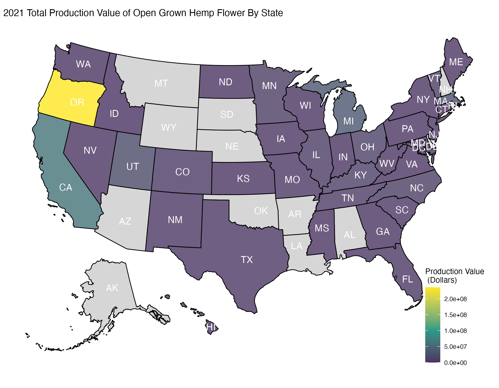

# Code for figures and maps from our 2021 Hemp Powdery Milew survey

Learning R can be hard. I'm uploading this code in hopes of helping you learn; I'm no expert and I'm not a very efficient coder, but I hope you will find it helpful regardless. 

## Load necessary libraries
If you haven't installed any of these libraries, remember you can typically install them through the `install.packages('packagenamehere')` command. 

* For notes on theme components, see [here](https://ggplot2.tidyverse.org/reference/theme.html).
* Map tips [here](https://cran.r-project.org/web/packages/osmplotr/vignettes/basic-maps.html)
* Custom bounding boxes [here](https://bigquerygeoviz.appspot.com/)

```r setup
library(tidyverse)          # manipulating and plotting data
library(usmap)              # preloaded us maps
library(scales)             # allows scale customization
library(ggnewscale)         # allows for two fill scales
library(readr)              # necessary for loading in csv data
library(lubridate)          # fast changing of dates
library(devtools)           # for loading packages not in CRAN.
library(readxl)             # for reading .xlsx files
library(sp)                 # special tools for spatial data
library(maps)               # loadable maps
library(gridExtra)          # making multi-plot figures
library(basemaps)           # loadable maps
library(sf)                 # special tools for spatial data
library(stars)              # special tools for spatiotemporal data
library(ggmap)              # mapping in a ggplot format
library(raster)             # reading spacial data
library(tidyUSDA)           # auto downloading data from USDA-SASS
library(rgdal)              # bindings to the 'Geospatial' Data Abstraction Library 
library(USAboundaries)      # loadable maps
```

## Load data
*You will have to change your path*

```r
#For disease incidence and taxa layers
Pamb_Pmac_combined_PCR_Positives_Summary_2021 <- read_excel("~2021-Pamb_Pmac_combined_PCR_Positives_Summary.xlsx")
x2022_OR_Raw_Data <- read_excel("~2022_Hemp_Disease_Survey_Field_Info.xlsx", sheet="OR Raw Data")
x2022_WA_Raw_Data <- read_excel("~2022_Hemp_Disease_Survey_Field_Info.xlsx", sheet="WA Raw Data")
x2021_datasheet <- read_excel("~2021_Hemp_PM_Survey_Data.xlsx")

#For sampling sites layer
x2022_Hemp_Disease_Survey_Field_Info_and_Data <- read_excel("~2022_Hemp_Disease_Survey_Field_Info.xlsx")
Hemp_fields_surveyed_2021_22 <- read_excel("~2021-22_Hemp_fields_surveyed.xlsx", sheet= "Sampling_Sites")

#For acreage layer
Hop_acreage <- read_csv("~2017-Slightly-Modified-SASS_Hop_Data.csv")
Hop_acreage_2017 <- read_excel("~2021-22_Hemp_fields_surveyed.xlsx", sheet= "Hemp_Hop_ROUGH_Acreage_Data")
OR_growers <- read_excel("~2022_OR_Growers.xlsx")
WA_growers <- read_excel("~2022_WA_growers.xlsx")
x2021_hemp_national_acreage <- read_excel("~2021-Hemp_National_Acreage_Data.xlsx")
```
## Looking at hemp production by state
Download the [2021 hemp survey results](https://usda.library.cornell.edu/concern/publications/gf06h2430) and remove the spaces and special symbols ($ / , etc.) in the headers to make it more R friendly. You can do this in R, but I find ctrl+f and then replace to be super fast in excel. I replaced all spaces with underscores and wrote out symbols when present. 

```{r hemp usda}
hemp_open_production <- x2021_hemp_national_acreage %>%
  filter(Data_Item == "IN_THE_OPEN_UTILIZED_FLORAL_PRODUCTION_MEASURED_IN_DOLLARS")

# You might toy around with different breaks... I wasn't seeing enough contrast, so I increased the contrast with these breaks. 
my_breaks = c(0, 5000000, 10000000, 50000000, 200000000)

# Use USmap to quickly plot out the state values
plot_usmap(data = hemp_open_production,
           values = "Value",      # Value in this case is in dollars
           labels = TRUE,         # text labels
           label_color = "white", 
           face = "bold", 
           alpha = 0.8) +         # alpha = transparancy
  ggtitle("2021 Total Production Value of Open Grown Hemp Flower By State") +
  scale_fill_gradient2("Production Value \n (Dollars)",
                       low = "#440154",                 # purple
                       mid = "#279a86",                 # blue-green
                       high = "#fce724",                # yellow
                       na.value = "grey80",
                       midpoint = 100000000) +
  theme(
    legend.background = element_blank(),
    legend.position = c(0.9,0))

```


## Plotting county data

```r county data
# set the state and county names of interest
state_names <- c("Oregon", "Washington")

# get COUNTY data for a given state
counties_spec <- us_counties(resolution = "high", states = state_names)

# get STATE data
OR_WA_2<-us_states(resolution = "high", states = state_names) %>%
  st_transform(crs = 4326)

# get range of lat/longs from counties for mapping and river function
mapRange1 <- c(range(st_coordinates(counties_spec)[,1]),range(st_coordinates(counties_spec)[,2]))

# check quickly
ggplot() + 
  geom_sf(data=OR_WA_2, color = "gray30", lwd=2, fill=NA) +
  geom_sf(data=counties_spec, fill = NA, show.legend = F, color="gray50", lwd=0.4) +
  theme_bw()
```
[plot1](images/plot1.png)


## Using TidyUSDA
TidyUSDA is a pretty nifty library that enables quick downloading of USDA-SASS data. To see what things you can load in, you'll have to check out the USDA-NASS [quick stats website](https://quickstats.nass.usda.gov/). Unfortunately if you're like me and **running an M1 mac** there are mapping features that aren't yet supported in TidyUSDA, so keep that in mind. To get a USDA-NASS API key, fill out the quick form [here](https://quickstats.nass.usda.gov/api). 

More info on TidyUSDA [here](https://github.com/bradlindblad/tidyUSDA). 

```{r TidyUSDA data}
# uncomment below to get a quick tutorial of the library.
#vignette("using_tidyusda")  <- tutorial 

# enter your API key in the quotation marks below. 
key <- ''  

# to see all available categories
tidyUSDA::allCategory %>% head()

# lets look at the last available county data for hops (2017)
hop_county_harvest <- tidyUSDA::getQuickstat(
  sector= NULL,
  group= NULL,
  commodity= 'HOPS',
  category= NULL,
  domain='TOTAL',
  county= NULL,
  key = key,
  program = NULL,
  data_item = "HOPS - ACRES HARVESTED",
  geographic_level = 'COUNTY',
  year = "2017",
  state = c('WASHINGTON','OREGON'),
  geometry = TRUE,
  lower48 = TRUE, 
  weighted_by_area = FALSE)

# drop any counties that have null values
hop_county_harvest <- hop_county_harvest %>%
  drop_na(Value)

# need to rename a column for later
q <- colnames(hop_county_harvest)
q[1] <- "fips"
colnames(hop_county_harvest) <- q
hop_county_harvest$fips <- as.integer(hop_county_harvest$fips)

  ```
  
 ## Process address data
 For the privacy of growers, I won't link the excel spreadsheet with addresses, though it is available to the public. 
 
 When using address data, you have to convert it to lat/long before mapping it with a lot of the R mapping packages. In the box below I'm feeding in address data and the Google API is returning lat, long data in a new column. For a google API key, sign up [here](https://developers.google.com/maps/documentation/javascript/get-api-key). 
 
 ```{r process hemp addresses}
 
# insert your google api key
register_google(key = '')     # you have to sign up for this. 

# Function to add geo data will append your original df
geocoded <- data.frame(stringsAsFactors = FALSE) 
for(i in 1:nrow(OR_growers))
{
  result <- geocode(OR_growers$`Address`[i], output = "latlona", source = "goog")
  OR_growers$lon[i] <- as.numeric(result[1])
  OR_growers$lat[i] <- as.numeric(result[2])
  OR_growers$geoAddress[i] <- as.character(result[3])
}

# Now add geo data for Washington growers

geocoded <- data.frame(stringsAsFactors = FALSE) 
for(i in 1:nrow(WA_growers))
{
  result <- geocode(WA_growers$`Address`[i], output = "latlona", source = "goog")
  WA_growers$lon[i] <- as.numeric(result[1])
  WA_growers$lat[i] <- as.numeric(result[2])
  WA_growers$geoAddress[i] <- as.character(result[3])
}

# Combine the relevent columns into new dataframe
OR_grow_abb <- OR_growers[,20:22]
WA_grow_abb  <- WA_growers[,38:40]

# bind by rows to make one df
PNW_growers <- rbind(OR_grow_abb, WA_grow_abb)

```
## Base map
Maps are built in layers with the base layer typically being land/water. 

```r, creating base map
#use the map packages to make a dataframe of the polygons in map_data("state")
states <- map_data("state")


#Now we want to filter out a polygon from our states dataframe for Oregon
oregon_wash <- states %>%
  filter(region %in% c("oregon","washington"))

gcounty <- map_data("county") %>%
  filter(region %in% c("oregon", "washington"))


fipstab <-
    transmute(maps::county.fips, fips, county = sub(":.*", "", polyname)) %>%
    unique() %>%
    separate(county, c("region", "subregion"), sep = ",")

gcounty <- left_join(gcounty, fipstab, c("region", "subregion"))

counties <- st_as_sf(map("county", plot = FALSE, fill = TRUE))
counties <- subset(counties, grepl("florida", counties$ID))
counties$area <- as.numeric(st_area(counties))

#bounding box for the area
box <- make_bbox(long, lat, data = oregon_wash)

```

The stamen maps are really nice, but for whatever reason you can't overlay geom_sf onto gmap objects that easily (they don't line up because they're different coordinate types). I found a hack online to fix this, hence the next set of code below.

```r playing with the best looking map
gmap <- get_stamenmap(box, zoom = 7, maptype = "toner-background")

counties_spec_3857 <- st_transform(counties_spec, 3857) 

ggmap_bbox <- function(map) {
  if (!inherits(map, "ggmap")) stop("map must be a ggmap object")
  # Extract the bounding box (in lat/lon) from the ggmap to a numeric vector, and set the names to what sf::st_bbox expects:
  map_bbox <- setNames(unlist(attr(map, "bb")), 
                       c("ymin", "xmin", "ymax", "xmax"))
  
  # Coonvert the bbox to an sf polygon, transform it to 3857, and convert back to a bbox (convoluted, but it works)
  bbox_3857 <- st_bbox(st_transform(st_as_sfc(st_bbox(map_bbox, crs = 4326)), 3857))
  
  # Overwrite the bbox of the ggmap object with the transformed coordinates 
  attr(map, "bb")$ll.lat <- bbox_3857["ymin"]
  attr(map, "bb")$ll.lon <- bbox_3857["xmin"]
  attr(map, "bb")$ur.lat <- bbox_3857["ymax"]
  attr(map, "bb")$ur.lon <- bbox_3857["xmax"]
  map
}
counties_spec <- ggmap_bbox(gmap)


```
## Converting ojbects to geom_sf objects

```r geom sf conversion

# make into geom_sf objects
(Fields_surveyed <- st_as_sf(Hemp_fields_surveyed_2021_22, coords = c("Long", "Lat"), 
    crs = 4326, agr = "constant"))

# hemp grower locations
(PNW_grower_sites <- st_as_sf(PNW_growers, coords = c("lon", "lat"), 
    crs = 4326, agr = "constant"))

states <- st_as_sf(map("state", plot = FALSE, fill = TRUE))

```

## Okay, lets do some mapping of data. 

```r, using gmap base and county polygons

ggmap(counties_spec) + 
  coord_sf(crs = st_crs(3857)) + # force the ggplot2 map to be in 3857
  geom_sf(data = counties_spec_3857, inherit.aes = FALSE, fill = NA, color = "gray90") +
  geom_sf(data = county_and_yield_data,   
          aes(fill = as.numeric(Value),
       geometry = geometry), inherit.aes = FALSE) +
  #scale_fill_viridis_c()+
  scale_fill_gradient("Acres of Hops Harvested", 
                      low = "#F3E6DA",
                      high = "#C17D3E",
                      space = "Lab",
                      breaks = my_breaks,
                      labels = my_breaks,
                      na.value = "grey90",
                      trans="log",
                      guide = "colourbar",
                      aesthetics = "fill")  +
  new_scale_fill() +
  geom_sf(data = PNW_grower_sites,                       # cannabis growers
          aes(geometry = geometry),
          color = "black",
          fill = "gray",
          size = 3,
          shape = 21,
          inherit.aes = FALSE) +
  geom_sf(data = Fields_surveyed,                          # sampling locations
          aes(geometry = geometry,
              color = Year), #fill = Year),
          fill = "white",
          #colour="gray30",
          size = 3,
          shape = 21, 
          alpha = 0.9,
          inherit.aes = FALSE) +
  scale_color_manual(values = col_year,
    breaks = c("2021", "2022")) +
  theme(legend.key=element_blank(),         # removes gray box behind symbols
        legend.position = "right",
        axis.title = element_blank(),       # removes "lat" and "long" labels
        axis.ticks = element_blank(),
        axis.text = element_blank())        # removes "lat" and "long" values


ggsave("plot4.png", width = 8, height = 11, units = "in", dpi = 300)
```
