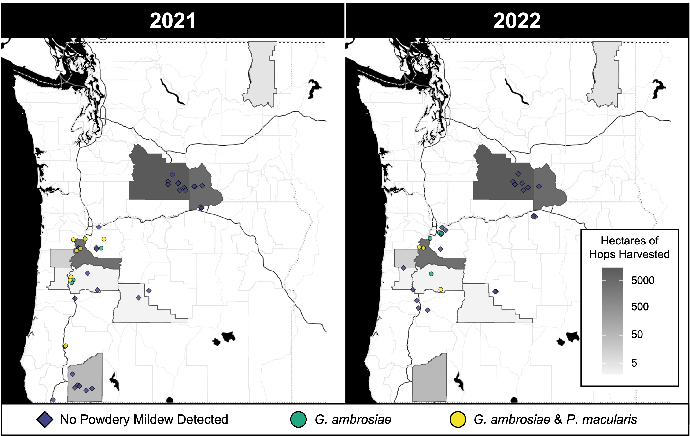

# Code for data produced in Rivedal et al. 2023 Hemp Powdery Mildew Survey submitted to PhytoFrontiers

## Map

Load necessary packages

```r
# Update: `library(USAboundariesData)` is no longer supported by CRAN; however, you can download it using remotes:
# install.packages("remotes")
# remotes::install_github("ropensci/USAboundaries")
# remotes::install_github("ropensci/USAboundariesData")

library(ggnewscale)
library(tidyverse)
library(sf)
library(ggmap)
library(USAboundaries)
library(USAboundariesData)
library(usmap)
library(ggpubr)
library(rgeos)

```

Load data

**Note: all of the coordinates have been heavily jittered to provide collaborating growers some anonimity.**

```r
summary_data <- read_csv("/data/map_data.csv")
glmm_data <- read_csv("/data/glmm_data.csv")
```

Base map

```r
# set the state and county names of interest
state_names <- c("Oregon", "Washington")
states <- map_data("state") 

# get STATE data
OR_WA_2<-us_states(resolution = "high", states = state_names) %>%
  st_transform(crs = 4326)
oregon_wash <- states %>%
  filter(region %in% c("oregon","washington"))

# get COUNTY data for a given state
counties_spec <- us_counties(resolution = "high", states=state_names)

counties_spec_3857 <- st_transform(counties_spec, 3857)

# bounding box for OR/WA
box <- make_bbox(long, lat, data = oregon_wash)

# get map for background
gmap <- get_stamenmap(box, zoom = 7, maptype = "toner-background")

counties_spec_3857 <- st_transform(counties_spec, 3857) 

ggmap_bbox <- function(map) {
  if (!inherits(map, "ggmap")) stop("map must be a ggmap object")
  # Extract the bounding box (in lat/lon) fdrom the ggmap to a numeric vector, 
  # and set the names to what sf::st_bbox expects:
  map_bbox <- setNames(unlist(attr(map, "bb")), 
                       c("ymin", "xmin", "ymax", "xmax"))
  
  # Coonvert the bbox to an sf polygon, transform it to 3857, 
  # and convert back to a bbox (convoluted, but it works)
  bbox_3857 <- st_bbox(st_transform(st_as_sfc(st_bbox(map_bbox, crs = 4326)), 3857))
  
  # Overwrite the bbox of the ggmap object with the transformed coordinates 
  attr(map, "bb")$ll.lat <- bbox_3857["ymin"]
  attr(map, "bb")$ll.lon <- bbox_3857["xmin"]
  attr(map, "bb")$ur.lat <- bbox_3857["ymax"]
  attr(map, "bb")$ur.lon <- bbox_3857["xmax"]
  map
}
stamen_county_map <- ggmap_bbox(gmap)

```

Download 2017 USDA Hop Yield by County Data (the last year available). Get an API key [here](https://quickstats.nass.usda.gov/api/). Read more about tidyUSDA [here](https://bradlindblad.github.io/tidyUSDA/).

```r

key <- 'insert-usda-api-key'. # get a key from USDA and paste it here

# lets look at the last available county data for hops (2017)
hop_county_harvest <- tidyUSDA::getQuickstat(
  sector= NULL,
  group= NULL,
  commodity= 'HOPS',
  category= NULL,
  domain='TOTAL',
  county= NULL,
  key = key,
  program = NULL,
  data_item = "HOPS - ACRES HARVESTED",
  geographic_level = 'COUNTY',
  year = "2017",
  state = c('WASHINGTON','OREGON'),
  geometry = TRUE,
  lower48 = TRUE, 
  weighted_by_area = FALSE)

# drop any counties that have null values
hop_county_harvest <- hop_county_harvest %>%
  drop_na(Value)

# add hectares column
hop_county_harvest$hectares <- hop_county_harvest$Value * 0.404686

```


Preparing our data

```r
# create dataframes for each mildew/year result combination
gamb_positives_2021_sf <- summary_data %>%
  filter(Year == 2021 & Gamb_pos_only == TRUE) %>%
  st_as_sf(coords = c("Long", "Lat"), crs = 4326)

gamb_positives_2022_sf <- summary_data %>%
  filter(Year == 2022 & Gamb_pos_only == TRUE) %>%
  st_as_sf(coords = c("Long", "Lat"), crs = 4326)

pmac_gamb_positives_2021_sf <- summary_data %>%
  filter(Year == 2021 & Gamb_pmac_pos == TRUE) %>%
  st_as_sf(coords = c("Long", "Lat"), crs = 4326)

pmac_gamb_positives_2022_sf <- summary_data %>%
  filter(Year == 2022 & Gamb_pmac_pos == TRUE) %>%
  st_as_sf(coords = c("Long", "Lat"), crs = 4326)

negative_2021_sf <- summary_data %>%
  filter(Year == 2021 & Negative == TRUE) %>%
  st_as_sf(coords = c("Long", "Lat"), crs = 4326)

negative_2022_sf <- summary_data %>%
  filter(Year == 2022 & Negative == TRUE) %>%
  st_as_sf(coords = c("Long", "Lat"), crs = 4326)

all_2022_positives <- summary_data %>%
  filter(Year == 2022) %>%
  filter(Gamb_pmac_pos == TRUE | Gamb_pos_only == TRUE) %>%
  st_as_sf(coords = c("Long", "Lat"), crs = 4326)

```

Full map

```
# Map for 2021
map_2021 <- ggmap(stamen_county_map) + 
  coord_sf(crs = st_crs(3857)) + # force the ggplot2 map to be in 3857
  geom_sf(data = counties_spec_3857, inherit.aes = FALSE, fill = NA, color = "gray90") +
  geom_sf(data = hop_county_harvest,   
          aes(fill = as.numeric(hectares),   
       geometry = geometry), inherit.aes = FALSE) +
  scale_fill_viridis_c()+
  scale_fill_gradient("2017 County Data\n for Acres of Hops Harvested", 
                      low = "#F3F3F3",
                      high = "#5a5a5a",
                      space = "Lab",
                      na.value = "grey90",
                      trans="log",
                      guide = "colourbar",
                      breaks = c(5, 50, 500, 5000,
                      aesthetics = "fill"))  +
  new_scale_fill() +
  geom_sf(data = negative_2021_sf,
          colour = "black",
          fill = "#414487FF",
          size = 1.5,
          shape = 23,
          alpha = 0.8,
          inherit.aes = FALSE) +
  geom_sf(data = gamb_positives_2021_sf,
          aes(geometry = geometry),
          fill = "#22A884FF",
          colour = "black",
          size = 1.5,
          shape = 21,
          alpha = 0.8,
          inherit.aes = FALSE) +
  geom_sf(data = pmac_gamb_positives_2021_sf,
          aes(geometry = geometry),
          fill = "#FDE725FF",
          colour = "black",
          size = 1.5,
          shape = 21,
          alpha = 0.8,
          inherit.aes = FALSE) +
  theme(legend.key=element_blank(),        
        legend.position = "right",
        axis.title = element_blank(),     
        axis.ticks = element_blank(),
        axis.text = element_blank())        


# Map for 2022
map_2022 <-ggmap(stamen_county_map) + 
  coord_sf(crs = st_crs(3857)) + # force the ggplot2 map to be in 3857
  geom_sf(data = counties_spec_3857, inherit.aes = FALSE, fill = NA, color = "gray90") +
  geom_sf(data = hop_county_harvest,   
          aes(fill = as.numeric(hectares),
       geometry = geometry), inherit.aes = FALSE) +
  scale_fill_viridis_c()+
  scale_fill_gradient("2017 County Data\n for Acres of Hops Harvested", 
                      low = "#F3F3F3",
                      high = "#5a5a5a",
                      space = "Lab",
                      na.value = "grey90",
                      trans="log",
                      guide = "colourbar",
                      breaks = c(5, 50, 500, 5000,
                      aesthetics = "fill"))  +
  new_scale_fill() +
  geom_sf(data = negative_2022_sf,
          colour = "black",
          fill = "#414487FF",
          size = 1.5,
          shape = 23,
          alpha = 0.8,
          inherit.aes = FALSE) +
  geom_sf(data = gamb_positives_2022_sf,
          aes(geometry = geometry),
          fill = "#22A884FF",
          colour = "black",
          size = 1.5,
          shape = 21,
          alpha = 0.8,
          inherit.aes = FALSE) +
  geom_sf(data = pmac_gamb_positives_2022_sf,
          aes(geometry = geometry),
          fill = "#FDE725FF",
          colour = "black",
          size = 1.5,
          shape = 21,
          alpha = 0.8,
          inherit.aes = FALSE) +
  theme(legend.key = element_blank(),        
      legend.position = c(0.8, 0.1), # adjust these values as needed
      legend.direction = "horizontal",
      legend.title = element_blank(),
      legend.box = "horizontal",
      legend.text = element_text(angle = 45),
      legend.text.align = 0.8,
      axis.title = element_blank(),     
      axis.ticks = element_blank(),
      axis.text = element_blank())   


figure <- ggarrange(map_2021, map_2022,
                    labels = c("2021", "2022"),
                    ncol = 2, nrow = 1,
                    label.x = 0.5)

ggsave("2021-2022-hemp-survey-map.png", width = 9, height = 6, units = "in", dpi = 300)
```

I then tidyed the figure up in powerpoint. 



# GLMM

```r
# Load the required libraries
library(lme4)
library(lsmeans)
library(Matrix)

```

```r
# Read the data into a data frame
data <- read.csv("C:\\Users\\david.gent\\Desktop\\Data_PM.csv")
```

```r
#Define incidence 
Data_PM$Incidence <- Data_PM$PowderyMildew / 10
Trials <- 10

#Convert the numeric code for SampleStage to a categorical variable
Data_PM$Stage <- as.factor(Data_PM$SampleStage)

# Subset the data for State = 'OR' and Year = 2021 or 2022
data1 <- subset(Data_PM, State == 'OR' & Year == 2021)
data2 <- subset(Data_PM, State == 'OR' & Year == 2022)

# Specify the GLMM formula

# + (1 | Stage:FieldName) 
# + (1 |Plant) + (1 | FieldName:Stage) 

# Fit the GLM using the glm function; Fit a GLMM using glmer function and specify random terms
model <- glm(cbind(PowderyMildew, Trials - PowderyMildew) ~ Stage, data = data1, family = binomial)

# Check if the covariance matrix is positive definite when fitting GLMM with random terms
# cov_matrix <- as.matrix(VarCorr(model)$fieldName
# eigenvalues <- eigen(cov_matrix)$values
# is_positive_definite <- all(eigenvalues > 0)
# if (is_positive_definite) {
#  cat("The matrix is positive definite.")
# } else {
#  cat("The matrix is not positive definite.")
# }

# Compute the confidence intervals for LSMeans
summary(model)
lsmeans(model, "Stage", type = "response", lsmeans_options = list(adjust
= "none"))

# Perform pairwise comparisons with lsadjustments using pairs()
lsmeans <- lsmeans(model, ~Stage)
contrasts <- contrast(lsmeans, method = "pairwise", adjust = "none")
print(contrasts)

# Residual diagnostic plots 
plot(model, which = 1)

# OR in 2022
model2 <- glm(cbind(PowderyMildew, Trials - PowderyMildew) ~ Stage, data = data1, family = binomial)

# Check if the covariance matrix is positive definite when fitting GLMM with random terms
# cov_matrix <- as.matrix(VarCorr(model)$fieldName
# eigenvalues <- eigen(cov_matrix)$values
# is_positive_definite <- all(eigenvalues > 0)
# if (is_positive_definite) {
#  cat("The matrix is positive definite.")
# } else {
#  cat("The matrix is not positive definite.")
# }

# Compute the confidence intervals for LSMeans
summary(model2)
lsmeans(model2, "Stage", type = "response", lsmeans_options = list(adjust
= "none"))

# Perform pairwise comparisons with lsadjustments using pairs()
lsmeans <- lsmeans(model2, ~Stage)
contrasts <- contrast(lsmeans, method = "pairwise", adjust = "none")
print(contrasts)

# Residual diagnostic plots 
plot(model2, which = 1)
```

# Summary table

```
# Load libraries
library(readxl)
library(dplyr)
```

```
PM = read_xlsx("Data_PM_Manuscript_04032023_2.xlsx", sheet = "Both-Master")
```

```
#head(PM)
PM$Cultivar=factor(PM$Cultivar)
PM2 = na.omit(PM)
PM2$SampleStage = factor(PM2$SampleStage)
PM2$FieldName = factor(PM2$FieldName)
PM2$Transect = factor(PM2$Transect)
PM2$Year = factor(PM2$Year)
PM2$State = factor(PM2$State)
PM2$county = factor(PM2$county)

PMSummary = summarise(group_by(PM2, Year, State, county, FieldName, Transect, SampleStage),
                  Plant = n(),
                  sumPM = sum(PowderyMildew),
                  avgPM = mean(PowderyMildew))
PMSummary2 = summarise(group_by(PM2, Year, State, county, FieldName),
                       Plant = n(),
                       sumPM = sum(PowderyMildew),
                       avgPM = mean(PowderyMildew))
PMSummary3 = summarise(group_by(PM2, Year, State),
                       Plant = n(),
                       sumPM = sum(PowderyMildew),
                       avgPM = mean(PowderyMildew))
PMSummary4 = summarise(group_by(PM2, Year, State, SampleStage),
                       Plant = n(),
                       sumPM = sum(PowderyMildew),
                       avgPM = mean(PowderyMildew))


```
